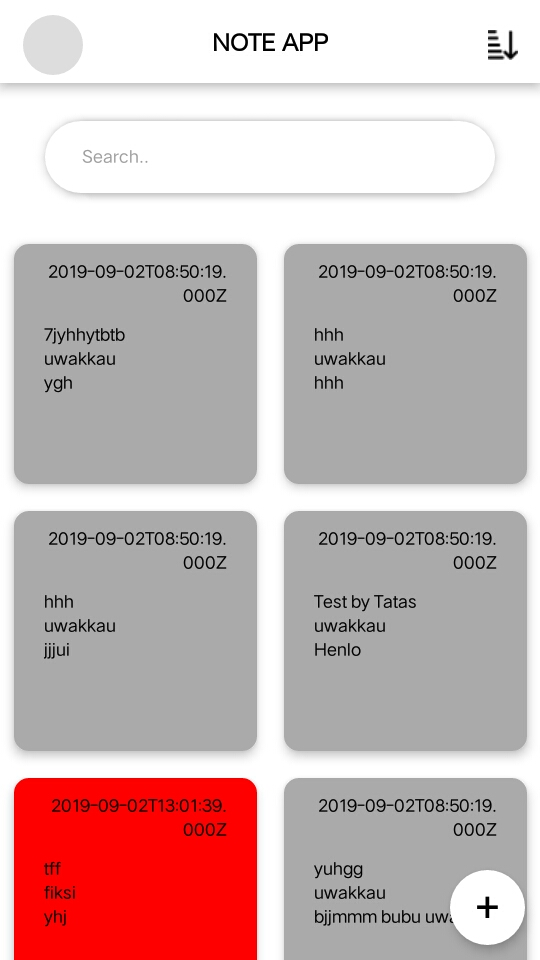
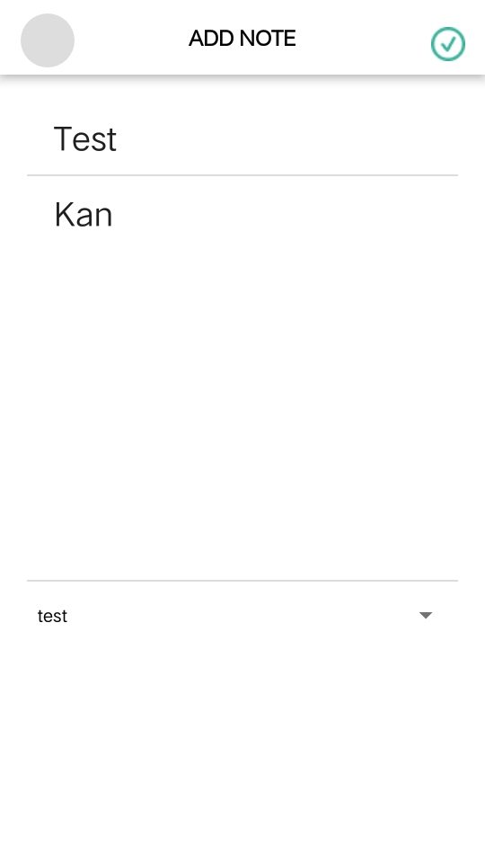
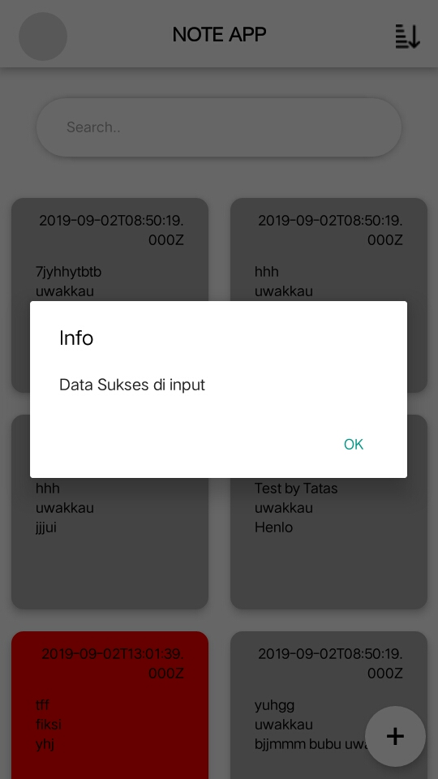
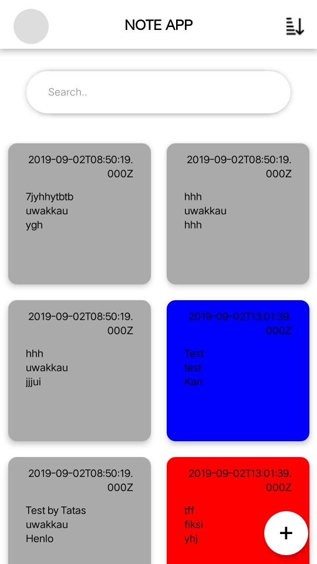

<h1 align="center">Simple Note App</h1>

  

## Table of Contents

- [Features](#features)
- [Screenshoot](#screenshoot)
- [Requirements](#requirements)
- [Usage](#usage-for-development)
- [Related Project](#related-project)
- [License](#license)

## Introduction
Simple Note App to make online note.

The purpose of this application is for people to make note easily

## Features
* Add Notes
* Edit Notes
* And Other
## Screenshoot

    
    
    
    

## Requirements
* [`npm`](https://www.npmjs.com/get-npm)
* [`react-native`](https://facebook.github.io/react-native/)
* [`react-native-cli`](https://github.com/react-native-community/cli)

## Usage for development
1. Open your terminal or command prompt
2. Type `git clone https://github.com/zidni0192/noteApp-ReactNative`
3. Open the folder and type `npm install` for install dependencies and `react-native link`
4. Before run this, you must run backend first
5. Type `react-native run-android` for run this app. ***Make sure your device is connected with debugging mode***.

## Related Project
<a href ='https://github.com/zidni0192/noteApp-backend'>Back End Book Management</a>

### License
[Beerware](https://en.wikipedia.org/wiki/Beerware "Beerware") © [Zidni](https://github.com/zidni0192 "Zidni")